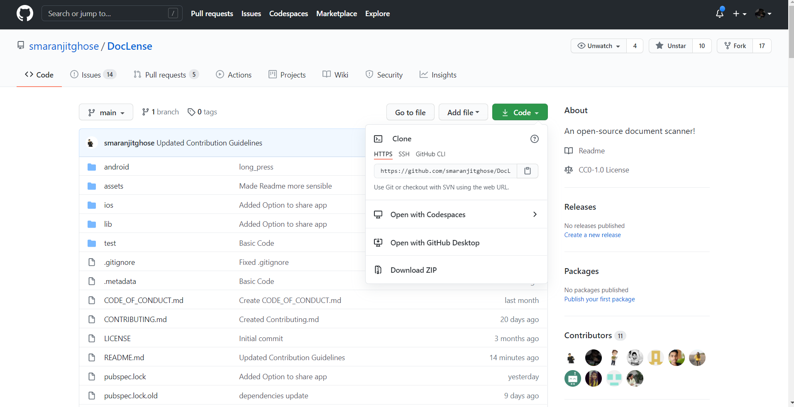
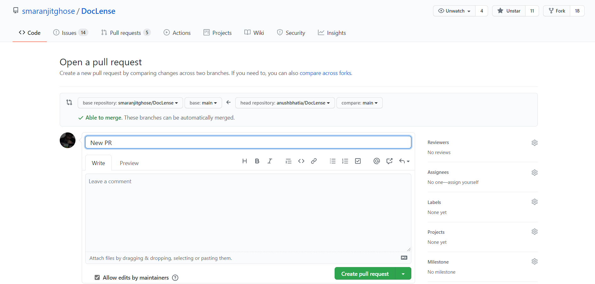
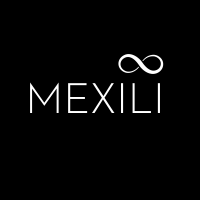

# DocLense📑🙈


An awesome open source document scanner maintained by the community for the citizens of the world!

<p align="center"></p>

## Features :


- Scan your documents with ease!
- Numerous choices of filters to choose from
- Auto-adjust size and focus on text
- Save in multiple formats
- Share as consolidated document across multiple platforms


## Contribution Guidelines🏗

Are we missing any of your favorite features, which you think you can add to it❓ We invite you to contribute to this project and make it improve it further.
 
To start contributing, follow the below guidelines: 

**1.**  Fork [this](https://github.com/smaranjitghose/awesome-portfolio-websites) repository.

**2.**  Clone your forked copy of the project.

```
git clone --depth 1 https://github.com/<your_user_name>/awesome-portfolio-websites.git
```


**3.** Navigate to the project directory :file_folder: .

```
cd awesome-portfolio-websites
```

**4.** Add a reference(remote) to the original repository.

```
git remote add upstream https://github.com/smaranjitghose/awesome-portfolio-websites.git 
```

**5.** Check the remotes for this repository.

```
git remote -v
```

**6.** Always take a pull from the upstream repository to your master branch to keep it at par with the main project(updated repository).

```
git pull upstream master
```

**7.** Create a new branch.

```
git checkout -b <your_branch_name>
```

**8.** Perform your desired changes to the code base.

<p align="center"></p>

**9.** Track your changes:heavy_check_mark: .

```
git add . 
```

**10.** Commit your changes .

```
git commit -m "Relevant message"
```

**11.** Push the committed changes in your feature branch to your remote repo.

```
git push -u origin <your_branch_name>
```

**12.** To create a pull request, click on `compare and pull requests`. Please ensure you compare your feature branch to the desired branch of the repo you are suppose to make a PR to.


**13.** Add appropriate title and description to your pull request explaining your changes and efforts done.


**14.** Click on `Create Pull Request`.




**15** Voila :exclamation: You have made a PR to the awesome-developer-portfolio project :boom: . Sit back patiently and relax while the project maintainers review your PR. Please understand at times the time can vary from a few hours to a few days

<p align="center"></p>

## The geeks🤓 behind this initiative:

### Our hard working Project Maintainers👨‍🏫:

<p align="center">
&ensp;&ensp;&ensp;

</p>

<a href="https://github.com/smaranjitghose">
<h5 align="center"><b>Smaranjit Ghose</b></a>&ensp;&ensp;&ensp;&ensp;&ensp;&ensp;&ensp;&ensp;&ensp;&ensp;&ensp;&ensp;&ensp;
<a href="https://github.com/anushbhatia"><b>Anush Bhatia</b></h5></a>

### Our valuable Contributors👩‍💻👨‍💻 :
<a href="https://github.com/smaranjitghose/awesome-portfolio-websites/graphs/contributors">
  
</a>

## Open Source Programs we have been a associated with: 

<p align="center">
<a href="https://devscript.tech/woc/"></a>
<a href="https://devscript.tech/woc/"></a>
<a href="https://hakincodes.tech/"></a>
<a href="https://scodein.tech/"></a>
<a href="https://njackwinterofcode.github.io/"></a>
</p>

## Code of Conduct
<p align="center"></p>

## License 
<p align="center"></p>
