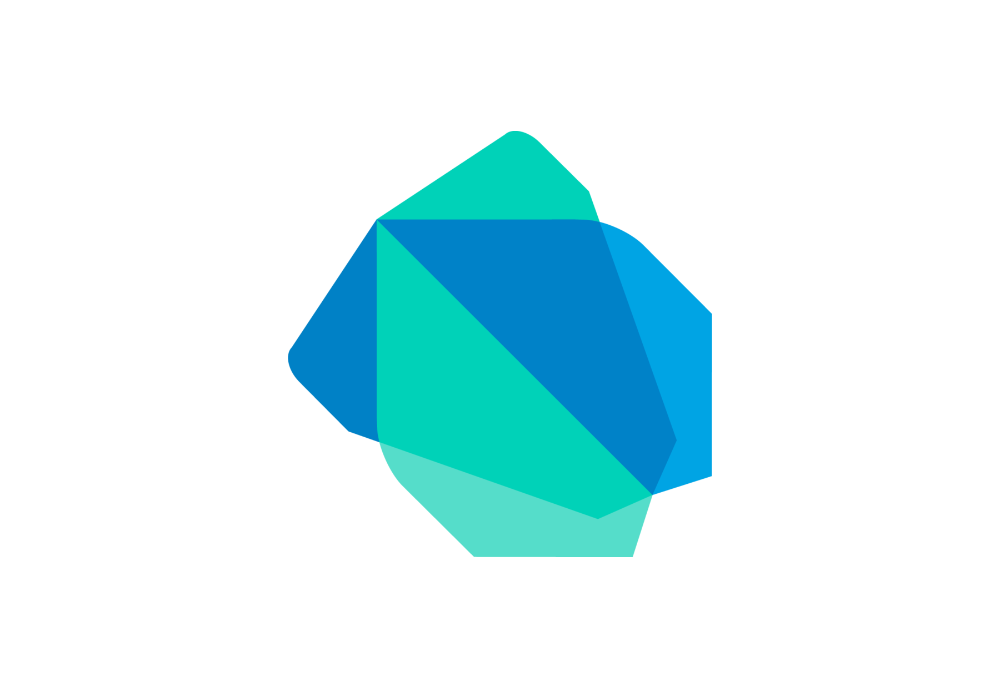

<h1 align = "center">DocLense📑🙈</h1>

**DocLense** : It is an application which can be used to scan and save the documents via your phone.

 
<h3> Features :</h3>
<ul>
<li>Scan variety of Docs</li>
<li>Options to customize the size the scanned pages (Crop)</li>
<li>Apply different types of filter</li>
<li>Download/Export in .pdf</li>
</ul>

 

<h3> What goes under the hood 🧐</h3>

 

<h3>Wanna Contibute ?</h3>
<ul>
<li>Fork the Repo.</li>
<li>Clone it.</li>
<li>Checkout a Branch.</li>
<li>Add Features/ Make Changes.</li>
<li>Commit Changes</li>
<li>Push them to the remote Repo.</li>
<li>Make a Pull Request.</li>
<li>Enjoy 😊✌</li>
</ul>
 

<h3> Our Love for Open Source 😍</h3>
<ul>
<li><b>Our Product Enhances : </b>As we know, <b>"Team Work leads to the Efficiency of any Task"</b>  So, we kept it Open Source to build our Team, leading to an Efficient Solution to the Problem.</li>
<li><b>Your Skills Enhance : </b> Increase your skillset through <b>Learning By Doing</b> method. We are a part of various Open Source Events, namely, <b>Hacktoberfest, Hakincodes</b>,<b>DevScript Winter of Code </b>and <b>PClub Summer Of Code</b></li>
</ul>
 

<h3> Our Contributers 👥</h3>

